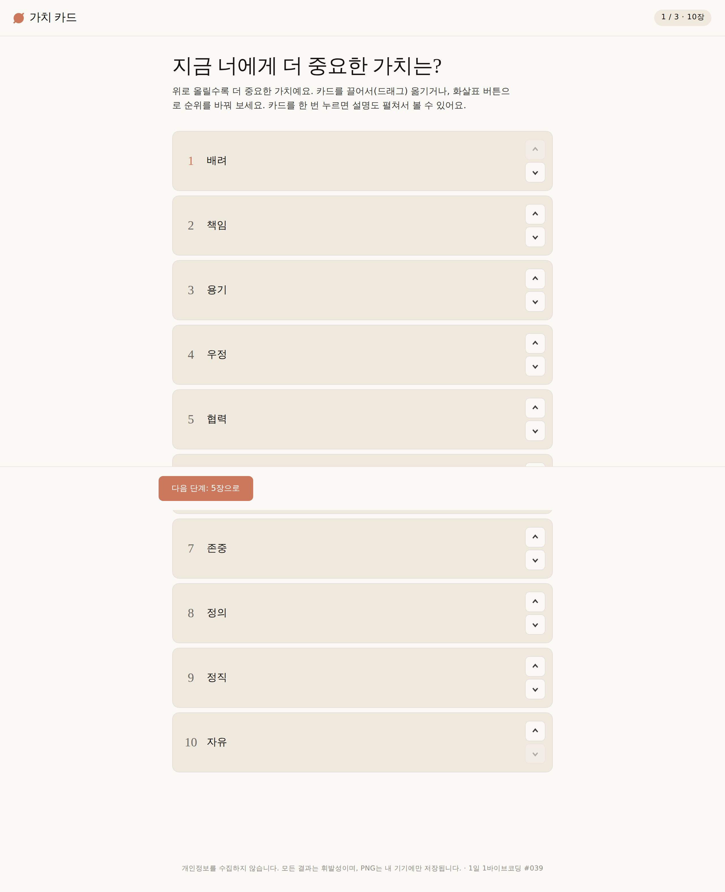
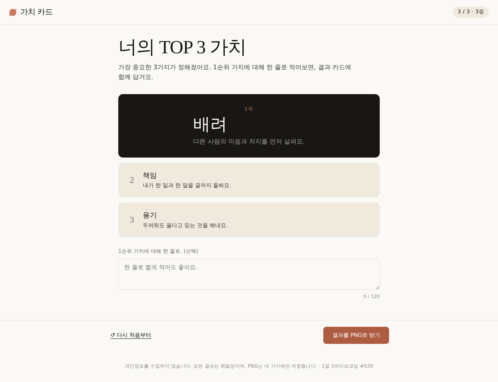
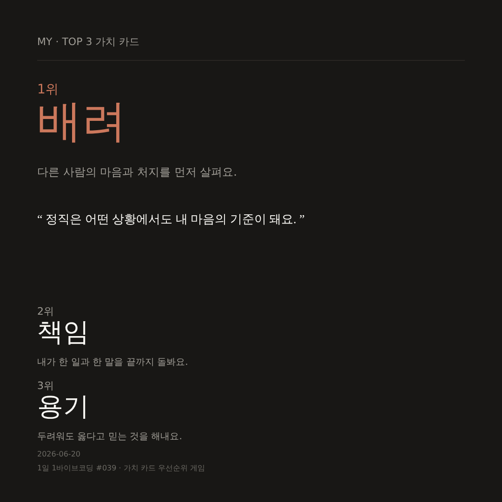

# #039 · 가치 카드 우선순위 게임 (도덕)

> 1일 1바이브코딩 챌린지 39일차 · 5~6학년 도덕 활동

학생이 정직·우정·자유 같은 가치 카드 **10장 → 5장 → 3장**으로 순서를 좁히면서 자기 가치관을 탐색해요. 결과는 익명 PNG로만 저장되고, 외부로 공유되지 않아요.

## 핵심 기능

- **드래그-앤-드롭 랭킹** — 마우스/터치/키보드 (↑↓) 모두 지원
- **3단계 압축** — 10 → 5 → 3 으로 자연스럽게 좁혀가요
- **카드 설명 펼치기** — 가치 단어만 보고 직관 정렬하지 않도록 한 줄 설명 제공
- **이름 없는 PNG 결과 카드** — 모둠 토의에 익명으로 띄우거나 출력
- **완전 오프라인** — CDN/네트워크 의존 0, 학교 망 차단 환경에서도 동작

## 안 만든 것 (의도적)

- 학생 식별 정보 입력 칸 (이름·반·번호 등) — 입력 자체가 없어요
- 외부 공유 버튼 (SNS, URL 단축, 카카오 등)
- 점수·정답·랭킹 — 가치관 탐색에는 정답이 없어요
- 외부 네트워크 호출 — Gemini API 등 일체 사용하지 않음

## 실행 방법

### 로컬에서
```bash
python3 -m http.server 5180 --bind 127.0.0.1
# 브라우저로 http://127.0.0.1:5180/ 접속
```
또는 `index.html` 을 더블클릭으로 열어도 동작합니다.

### 배포본
GitHub Pages 로 자동 배포 — README 상단 우측 링크 또는:
```
https://989-alt.github.io/project-39-gachi-kadeu-useonsuni-geim/
```

## 스크린샷

### 단계 1 — 10장 랭킹


### 단계 3 — TOP 3


### 결과 PNG (1080×1080)


## 기술

- 단일 `index.html` · vanilla JS · vanilla CSS
- HTML5 drag-and-drop · Canvas 2D (PNG export) · `prefers-reduced-motion`
- Playwright e2e 자동 검증

## 적용한 skill

- `brainstorming` — MUST/SHOULD/MUST NOT 정리 (docs/plans/01-brainstorm.md)
- `ui-ux-pro-max` — 접근성·터치 타깃·focus state 가이드
- `senior-devops` (코드 품질 원칙만) — vanilla 단일 HTML 결정
- `webapp-testing` — Playwright 자동 e2e

## 디자인 브랜드

[**Claude**](https://github.com/claude-anthropic/) (Anthropic) — warm cream canvas + 코랄 CTA + slab-serif editorial 디스플레이.  
가치를 사색하는 도덕 활동의 톤과 잘 맞아요. (design.md/claude/DESIGN.md 적용)

## 개인정보 정책

- 학생 이름·번호·식별자 **수집·저장·전송 안 함**
- 모든 상태는 페이지 새로고침 시 사라지는 휘발성
- PNG 결과는 학생 본인 기기에 다운로드되며 서버로 가지 않음

---

🤖 Claude Code (`claude-opus-4-7[1m]`)로 자동 생성된 1일 1바이브코딩 챌린지 결과물.
